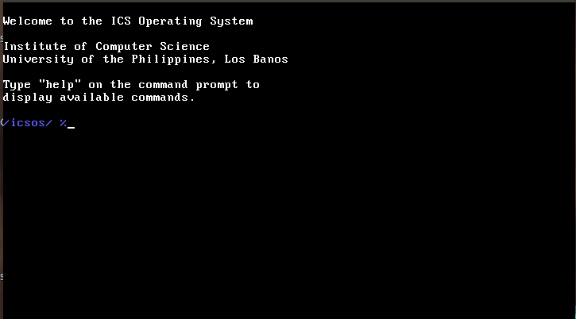

## About

Modern real-world operating systems are too complex to be taught to undergraduates and other instructional operating systems are not complete and usable and do not work on real hardware. By providing students with a _not so complex_ working operating system to play with, they will be able to appreciate and understand deeper the concepts underlying an operating system.

Thus, this project aims to develop a simple yet operational instructional operating system for teaching undergraduate operating systems courses. ICS-OS is a fork of <a href='http://sourceforge.net/projects/dex-os'>DEX-OS</a> by Joseph Dayo.

## Downloads

Latest floppy image: <a href='https://github.com/srg-ics-uplb/ics-os/raw/master/ics-os/ics-os-floppy.img'>ics-os-floppy.img</a>

## Build Environment

Ubuntu 16.04 64-bit is the last tested working build environment. Virtualbox can be used 
to run this version of Ubuntu.  However, docker is the recommended build environment since new versions 
of Ubuntu do now work anymore.

### Using Docker to build

ICS-OS is a 32-bit operating system and requires a 32-bit build environment. You need to install 
[docker](https://docs.docker.com/engine/install/ubuntu/) and [docker-compose](https://docs.docker.com/compose/install/) 
to build the ICS-OS kernel and user applications.

Run the following command to enter the build environment:

`$docker-compose run ics-os-build`

You will be dropped to a shell where you can perform the build. The ics-os folder is mapped inside the container. Thus, 
you can perform the edits outside the container and the changes will be reflected inside the build environment.

```
#cd /home/ics-os
#make clean
#make
#exit
```
Make the floppy image then boot.

```
$sudo make floppy
$make boot-floppy
```

Alternatively, you can boot the floppy image directly using qemu.
```
$qemu-system-i386 -fda ics-os-floppy.img
```

## Development and Support
This project is used at the <a href='http://www.ics.uplb.edu.ph'>Institute of Computer Science</a>, <a href='http://www.uplb.edu.ph'>University of the Philippines Los Banos</a> for <a href='http://ics.uplb.edu.ph/courses/ugrad/cmsc/125'>CMSC 125</a>. It is maintained by the <a href='http://srg.ics.uplb.edu.ph'>Systems Research Group</a>.

Get started by reading the <a href="https://github.com/srg-ics-uplb/ics-os/wiki/Kernel-Developer's-Guide">Kernel Developer's Guide</a>.

Don't forget to check the <a href="http://github.com/srg-ics-uplb/ics-os/wiki">Wiki</a>.

You can ask questions <a href="https://groups.google.com/forum/#!forum/ics-os">here</a>.

## Citation

If you find his resource useful in your research, please cite our work.


J. A. C. Hermocilla. Ics-os: A kernel programming approach to teaching operating system concepts. Philippine Information Technology Journal, 2(2):25--30, 2009.


You can also use the bibtex entry below.

```
@article{hermocilla-ics-os-pitj2009,
  author = {Hermocilla, J. A. C.},
  title = {ICS-OS: A Kernel Programming Approach to Teaching Operating System Concepts},
  journal = {Philippine Information Technology Journal},
  volume = {2},
  number = {2},
  year = {2009},
  issn = {2012-0761},
  pages = {25--30},
  publisher = {Philippine Society of Information Technology Educators and Computing Society of the Philippines },
  address = {Philippines},
  pdf = {hermocilla-pitj2009-ics-os.pdf}
}
```
